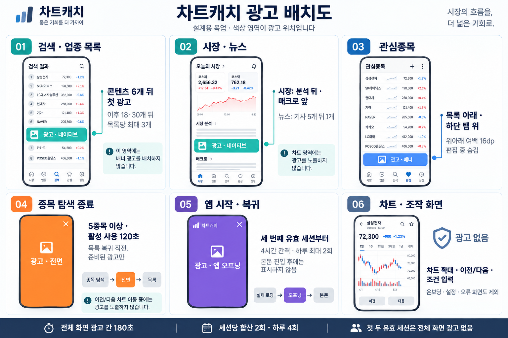

# 차트캐치 광고 위치·타이밍 설계

작성일: 2026-09-13 · 대상: `kscreener-app` Flutter iOS/Android · 상태: 구현 전 설계



위 이미지는 내장 image_gen으로 생성한 설계용 목업이다. 화면의 종목·수치·아이콘은 예시이며 실제 앱 스크린샷이 아니다. 상세 조건은 본문을 따른다. [생성 프롬프트](docs/images/ad-placement-prompt.md)

## 1. 결정 요약

**시장·업종·뉴스에는 네이티브 광고를 사용하고, 검색과 관심종목에는 하단 배너를 사용한다. 앱 오프닝은 재방문 로딩 시점, 전면광고는 여러 종목 탐색을 끝내고 목록으로 복귀하는 시점에만 노출한다.**

목표는 사용자당 장기 광고 매출의 최대화다. 노출 횟수나 클릭률만 높이는 대신, 광고 수익과 재방문·검색 완료율을 함께 측정한다. 아래 횟수·시간·간격은 **출시 실험용 제품 기본값이며 Google의 정책상 허용 한도나 검증된 수익 최적값이 아니다.** 실제 트래픽·노출률·eCPM 데이터가 없어 최대 수익이나 특정 매출을 보장할 수 없다.

| 형식 | 기본 위치 | 최초 노출·반복 조건 | 역할 |
|---|---|---|---|
| 네이티브 | 오늘의 시장, 업종 목록·상세, 뉴스 | 실제 콘텐츠 사이 지정 위치; 화면당 최대 3개 | 긴 탐색에서 자연스럽게 노출 확보 |
| 배너 | 검색·관심종목 탭 하단 전용 영역 | 정상 본문 표시 및 비입력·비편집 상태; 화면에 1개 | 반복 방문 수익 확보 |
| 앱 오프닝 | 앱 시작/복귀의 실제 로딩 화면 | 첫 실행 제외, 두 번째 콜드 스타트부터; 이전 노출 후 4시간, 하루 2회 이하 | 재방문 수익 확보 |
| 전면 | 검색/업종에서 시작한 종목 탐색 → 원래 목록 복귀 직전 | 서로 다른 종목 5개 이상 유효 열람, 세션 사용 120초 이상 | 탐색 완료 시 수익 확보 |

전면·앱 오프닝 합산은 **세션당 2회, 하루 4회 이하**, 두 전체 화면 광고 사이에는 **최소 180초**를 둔다. 전면 자체는 세션당 2회·하루 3회 이하이며, 더 엄격한 제한이 항상 우선한다. 네 형식을 한 화면에 모두 쌓지 않는다.

## 2. 현재 앱과 설계 근거

실제 구현을 기준으로 확인했다. README의 과거 설명과 달리 종목 이동은 현재 세로 스와이프가 아닌 이전/다음 버튼이다.

| 확인한 파일 (`../kscreener-app/` 기준) | 현재 구조 | 설계에 미치는 영향 |
|---|---|---|
| `lib/screens/shell.dart` | 시장·업종·검색·관심·설정 5개 탭, `IndexedStack` 유지 | 숨은 탭도 살아 있으므로 활성 화면 광고만 요청·표시해야 함 |
| `lib/screens/search.dart` | 조건·범위 변경, 고정 높이 종목 목록, 상세 진입 | 검색 본문은 항상 유지하고 하단 배너만 별도 영역에 표시 |
| `lib/screens/detail.dart` | 이전/다음 이동, 차트·패턴 패널, 가로 모드 | 버튼·차트 조작 중 광고 금지; 탐색 종료를 별도로 감지 |
| `lib/screens/market.dart` | 지수 카드 → 광고 → 차트 → 분석 → 매크로 → 고지 | 차트 바로 위 네이티브 1개를 별도 영역에 표시 |
| `lib/screens/sector_detail.dart` | 업종 차트·해설 + 종목 목록 | 차트 뒤가 아닌 종목 목록의 실제 6개 뒤에 삽입 |
| `lib/screens/news.dart` | 뉴스 목록과 외부 브라우저 이동 | 기사 뒤 네이티브 가능; 외부 기사에서 복귀할 때 오프닝 억제 |
| `lib/main.dart` | 온보딩, 데이터 없는 경우 Splash, 이후 Shell | 두 번째 실행부터 오프닝 준비 기회를 최대 4초 유지하되 본문 준비를 막지 않음 |
| `lib/services/app_analytics.dart` | 검색·상세 진입·외부 이동 및 `adRevenue()` 준비 | 광고 SDK 연결, 실제 열람 시간·이전/다음 계측 추가 필요 |
| `pubspec.yaml` | Firebase 포함, 광고 SDK 없음 | 광고 관리자·동의·수익 계측은 신규 구현 대상 |

기획 원본을 본체 저장소에 둔다는 앱 README 규칙에 따라 본 문서를 `StockScreener`에 저장한다. 기존 `APP_MONETIZE.md`의 광고 위치·빈도와 충돌하면 본 문서를 우선한다. 기존 문서의 구독·보상형·법률 해석·단가 가정은 이번 설계의 전제로 삼지 않는다. 이번 범위는 네 가지 광고의 배치 설계이며 기능 제한·구독 추가는 포함하지 않는다.

## 3. 화면별 배치

| 화면 | 기본 광고 | 구체 위치·조건 | 제외 위치 |
|---|---|---|---|
| 오늘의 시장 | 네이티브 1개 | 지수 카드 다음, `_chart` 바로 위; 정상 차트 데이터 표시 시 | 지수 카드 위, 차트 내부, 분석·고지 영역 |
| 업종 목록 | 네이티브 | 업종 6·18·30개 뒤, 뒤에 실제 업종이 하나 이상 남을 때 | 상위 업종보다 먼저, 업종 순위·등락률 행으로 위장 |
| 검색 결과 | 적응형 배너 1개 | 검색 본문 아래, 하단 탭 위; 결과가 있고 키보드가 닫힌 경우 | 조건·범위·결과 본문을 대체하거나 덮는 영역, 검색 입력 중 |
| 업종 상세 | 네이티브 | 종목 6·18·30개 뒤; 차트·설명은 개수에서 제외 | 업종 차트나 지표 토글 사이 |
| 관심종목 | 적응형 배너 1개 | 목록 본문 아래, 하단 탭 위 별도 영역; 그룹 내 종목 3개 이상 | 빈 그룹, 추가·삭제·이름 변경·편집 중 |
| 종목 상세 | 없음 | 종료 시 전면광고 후보만 판정 | 차트 위/아래 배너, 이전/다음마다 전면광고 |
| 전체 화면 차트 | 없음 | 세로·가로 모두 보호 | 확대·축소·스크럽·회전 중 모든 광고 |
| 매크로 상세 | 없음 | 초기에는 읽기 흐름 유지 | 차트·기간 변경·뉴스 버튼 주변 |
| 뉴스 목록 | 네이티브 1개 | 기사 5개 뒤, 기사 6개 이상일 때 | 첫 기사 위, 외부 기사 열기 전 전면광고 |
| 설정·온보딩·문의·동의 UI | 없음 | 광고 관련 설정 접근도 광고 없이 제공 | 모든 영역 |
| 로딩 실패·빈 결과·오프라인 오류 | 없음 | 정상 콘텐츠 복구 후 다음 기회부터 | 재시도 버튼 주변, 오류 화면을 이용한 전면광고 |

### 네이티브 광고 표시 규칙

- 업종 결과 수, 정렬 순서, 종목 위치, 이전/다음 탐색 배열은 **실제 종목만** 기준으로 유지한다. 광고를 데이터 객체로 넣지 않는다.
- 6·18·30은 업종 목록·상세에서 광고를 제외한 콘텐츠 순번이다.
- 시장·뉴스는 최대 1개, 나머지 목록은 최대 3개. 한 뷰포트에는 네이티브 최대 1개가 보이도록 작은 화면에서도 확인한다. 같은 화면의 고정 배너와 중복하지 않는다.
- 카드에 명확한 `광고` 표기, 광고주, SDK 요구 자산과 AdChoices를 표시한다. 앱의 종목 추천·뉴스 기사처럼 꾸미거나 관심종목 별·등락률 배지를 광고에 붙이지 않는다. 광고 식별 표시와 AdChoices 기준은 [Google 네이티브 안내](https://support.google.com/admob/answer/6239795?hl=en)를 따른다.
- 첫 슬롯 도달 전 미리 로드하되, 현재 슬롯과 다음 슬롯 정도만 준비한다. 슬롯 키는 결과 버전과 위치로 고정한다. 리빌드·스크롤 왕복·정렬 변경마다 재요청하지 않는다.
- 결과 갱신 시 광고 영역을 포함한 레이아웃을 함께 결정한다. 로딩 중에는 비클릭 예약 영역만 사용하고, 실패 슬롯은 화면 밖 또는 다음 결과 갱신 때 정리한다. 손가락 아래에 광고가 갑자기 삽입되거나 콘텐츠가 이동하지 않아야 한다.
- 네이티브는 자체 타이머 자동 교체를 사용하지 않는다. 데이터/화면 변경 시 필요한 로드를 판단하고, 같은 슬롯 교체의 최소 간격은 초기 60초로 둔다. 간격 만료 자체가 요청 트리거는 아니다.

### 배너 표시 규칙

검색·관심종목 탭에서 anchored adaptive 배너를 사용한다. 검색에서는 조건·결과 본문을 항상 먼저 렌더링하고 배너는 하단 탭 위의 별도 `bottomNavigationBar` 영역에만 둔다. 이름 검색으로 키보드가 열린 동안에는 숨긴다. 하단 탭에 바로 붙이지 않고 배너 위·아래 구분선과 **16dp 비클릭 여백을 초기 디자인 값**으로 둔다. 이 값은 정책의 안전거리 보증이 아니다. 작은 화면·큰 글자·제스처 내비게이션에서 탭 오클릭 가능성이 있으면 여백을 늘리거나 배너를 생략한다. [Google 배너 배치 안내](https://support.google.com/admob/answer/6275345?hl=en)

```text
관심종목 목록 (독립적으로 스크롤)
─────────────────────────────
16dp 비클릭 여백
적응형 배너 전용 영역
16dp 비클릭 여백
─────────────────────────────
시장 | 업종 | 검색 | 관심 | 설정
기기 하단 안전 영역
```

배너는 본문을 덮지 않고 자신의 높이를 차지한다. 충분한 본문 공간이 없거나 키보드·시트가 열리면 숨긴다. 탭 이동으로 매번 새 광고를 만들지 않으며, 비활성 탭·상세 화면에 가려진 배너는 광고 뷰를 분리하거나 해제하여 숨은 요청을 방지한다. 갱신은 AdMob의 자동 갱신 설정을 사용하고 앱 타이머로 추가 갱신하지 않는다. SDK의 자동 갱신은 화면에 보일 때 이루어진다. [Flutter 배너 문서](https://developers.google.com/admob/flutter/banner)

## 4. 전면광고의 노출 시점

이 앱은 자유롭게 오가는 도구여서 자연스러운 단절이 적다. 따라서 전면광고는 제한된 보조 지면으로 시작한다. Google도 전면광고를 콘텐츠 사이의 자연스러운 전환에 배치하도록 안내한다. [전면광고 적합성 안내](https://support.google.com/admob/answer/6066980?hl=en)

### 기본 트리거: 종목 탐색 종료

1. 검색 결과 또는 업종 상세의 종목 목록에서 상세 화면을 연다.
2. 서로 다른 종목의 차트가 정상 표시되고 각각 전경에서 5초 이상 활성 열람되면 1개씩 센다. 이전/다음 버튼 이동도 포함한다. 로딩·광고·백그라운드 시간은 제외한다.
3. 현재 세션에서 마지막 전면 노출 이후 5개 이상 열람하고, 광고를 제외한 세션 활성 사용이 120초 이상이면 후보가 된다.
4. 사용자가 상세를 닫아 원래 목록으로 돌아가는 **전환 직전**에 공통 제한을 확인한다. 상세 내부 차트 페이지 닫기, 뉴스 닫기, 관심종목에서 온 상세 복귀는 제외한다.
5. 준비된 광고가 있을 때만 1회 표시하고 닫힘/표시 실패 후 원래 목록으로 정확히 한 번 복귀한다. 광고가 없으면 즉시 복귀한다.
6. 실제 노출이 확인되면 유효 열람 집합을 비운다. 후보만 되었거나 광고가 없었다면 집합을 유지하되, 다음 명시적 탐색 종료까지 표시하지 않는다.

목록을 먼저 보여준 뒤 몇 초 후 광고를 띄우지 않는다. iOS 뒤로 가기 제스처와 Android 뒤로 가기의 **완료된 전환 경계**에서 안전하게 처리할 수 없는 경우 해당 복귀는 생략한다. 취소한 제스처나 단순 `pop` 콜백 뒤에 광고를 끼우지 않는다. 사전 로드와 전환 시점의 중요성은 [권장 전면 구현](https://support.google.com/admob/answer/6201350?hl=en)을 참고한다.

### 노출하지 않는 행동

종목명 입력, 조건 적용, 슬라이더 변경, 탭 이동, 종목 상세 첫 진입, 이전/다음 누르기, 즐겨찾기 저장, 뉴스 링크 누르기, 앱 종료는 전면 트리거가 아니다. 특히 앱 시작·종료에 일반 전면광고를 배치하지 않는다. [금지 전면 구현](https://support.google.com/admob/answer/6201362?hl=en-GB)

기존 초안의 ‘검색 3~5회마다 전면’은 이 설계에서 사용하지 않는다. 세션 대부분이 1~2종목만 보는 흐름이라 전면 노출률이 낮더라도, 이를 보완하려고 조작 중 광고를 강제로 넣지 않는다. 위치·빈도 개선은 실험으로 결정한다.

## 5. 앱 오프닝 광고

### 자격과 시점

- 설치 후 첫 콜드 스타트에서는 표시하지 않고, 두 번째 콜드 스타트부터 허용한다. 실행 횟수는 기기에 영구 저장하며 화면 회전·탭 전환·단순 복귀는 새 실행으로 세지 않는다.
- 콜드 스타트는 두 번째 실행부터 광고 준비를 최대 4초 기다린다. 준비되면 시작 화면 위에서 표시하고, 실패·동의 불가·시간 초과 시 즉시 본문으로 진행한다.
- 웜 스타트는 백그라운드 30분 이상 후 복귀하면서 실제 초기 데이터 로딩/갱신 화면을 거치는 경우에만 허용한다. 단순 `resumed` 이벤트는 표시 근거가 아니다.
- 현재 앱은 snapshot이 있으면 바로 Shell을 보여주므로, 일반 웜 스타트는 기본적으로 생략된다. 광고를 위해 가짜 로딩이나 새로고침을 만들지 않는다.
- 최대 4초 대기 시간이 지난 뒤 첫 콘텐츠가 표시되면, 늦게 로드된 광고를 본문 위에 갑자기 표시하지 않는다.
- 이전 오프닝 노출로부터 4시간 이상, 하루 최대 2회, 공통 합산 제한을 모두 만족해야 한다. 캐시 광고도 로드 후 4시간 이상이면 폐기한다. **재노출 간격과 SDK 캐시 유효기간은 서로 다른 조건**이다.

첫 실행을 제외하고, 시작 기회가 끝난 뒤 늦게 표시하지 않는 동작은 [Flutter 앱 오프닝 문서](https://developers.google.com/admob/flutter/app-open)를 따른다. 광고 SDK·동의·로컬 저장소 초기화가 지연되거나 실패하더라도 시작 화면을 광고가 붙잡아서는 안 된다.

### 복귀 예외

외부 뉴스·증권 사이트·문의 메일·광고 클릭·권한 요청·동의 폼에서 돌아오는 복귀는 시간과 무관하게 1회 억제한다. 외부 이동 직전에 원인 토큰을 남기고 복귀 때 소비한다. 광고 표시 중 발생한 foreground 이벤트도 차단한다. 실패한 외부 실행의 토큰은 제거하며, 프로세스 종료 후 재실행도 가능하면 저장한 이동 상태로 보호한다.

## 6. 네 형식의 공통 제어

### 세션·횟수 정의

앱 오프닝은 첫 콜드 스타트만 제외한다. 전면광고는 기존대로 완료된 30초 이상 콘텐츠 사용 세션 2회를 자격으로 요구한다. 이후 각 형식의 조건을 추가로 판정한다.

광고 정책 세션은 앱 콜드 스타트 또는 30분 이상 백그라운드 후 복귀로 시작한다. Firebase 세션과 별도 정의이며 화면 회전·탭 전환·광고 클릭 복귀로 새로 만들지 않는다. 짧은 재실행으로 제한이 풀리지 않도록 최근 활동 및 카운터를 영속화한다. 외부 이동 복귀는 같은 정책 세션으로 유지한다.

하루는 `Asia/Seoul` 00:00~24:00으로 고정한다. 일일 카운터는 영속 저장하고 날짜가 바뀌어도 마지막 전체 화면 광고 후 180초와 오프닝 후 4시간 조건은 유지한다. 활성 시간 측정에는 단조 시계를 사용하고 시스템 시간 역행 시 제한을 완화하지 않는다.

| 파라미터 | 기본값 | 적용 |
|---|---:|---|
| `fullscreen_min_gap_sec` | 180 | 직전 전체 화면 광고 종료부터 다음 표시까지 |
| `fullscreen_session_cap` / `fullscreen_daily_cap` | 2 / 4 | 전면 + 오프닝 합산 |
| `interstitial_session_cap` / `interstitial_daily_cap` | 2 / 3 | 전면 별도 상한 |
| `interstitial_min_active_sec` | 120 | 현재 정책 세션의 광고 제외 활성 시간 |
| `interstitial_distinct_stocks` / `stock_min_view_sec` | 5 / 5 | 유효 열람 조건 |
| `app_open_first_launch_excluded` / `app_open_startup_wait_sec` | 1 / 4 | 첫 실행 제외 및 시작 광고 준비 최대 대기 |
| `app_open_min_gap_sec` / `app_open_daily_cap` | 14400 / 2 | 오프닝 별도 제한 |
| `native_first_after` / `native_interval` / `native_list_cap` | 6 / 12 / 3 | 시장·뉴스는 별도 1개 규칙 |
| `ads_enabled` + 형식/지면별 스위치 | 단계 배포 | 문제 지면 즉시 차단 |

횟수는 SDK 노출 콜백에서 증가시키고 앱 요청 횟수와 구분한다. 표시 시도 중에는 잠금을 잡아 중복 이벤트를 막는다. 표시가 시작됐다면 콜백 누락에도 재표시되지 않도록 해당 광고 객체를 소비 처리한다. 닫힘·실패 어느 경로에서도 잠금과 내비게이션 대기를 해제한다.

### 판단 순서

```text
광고 요청 가능 여부와 전체/지면 스위치 확인
→ 활성 화면·사용자 동작·온보딩/오류/동의/외부 복귀 예외 확인
→ 해당 형식의 자연스러운 노출 기회인지 확인
→ 공통 상한과 형식별 상한 확인
→ 준비된 유효 광고 확인
→ 표시 직전 동일 조건 재검사 + 전체 화면 표시 잠금
→ 표시 또는 즉시 원래 동작 진행
```

오프닝에서 건너뛴 기회를 전면으로 대체하지 않는다. 전체 화면 광고를 닫은 직후 두 번째 광고를 대기열에서 실행하지 않는다. 목록의 기존 인라인 광고는 복귀 시 그대로 보일 수 있으나, 닫힘을 계기로 새 광고를 요청·갱신하지 않는다. 실패 시 백오프를 두고, 화면 전환을 기다리게 하거나 재시도 완료 때 자동 표시하지 않는다.

## 7. 수익 계측과 최적화

### 계산

형식별 일 매출은 `실제 노출 수 × 해당 형식·OS·국가의 관측 eCPM / 1,000`이다. 합계를 DAU로 나누면 광고 ARPDAU다. 노출 수가 아직 없을 때는 `노출 기회 × 요청 가능 비율 × 광고 확보 비율 × 확보 후 실제 노출 비율`로 분해해서 추정한다. 이미 실제 노출 수로 계산했다면 이 비율을 다시 곱하지 않는다.

다음은 **계산 예시일 뿐 시장 단가나 매출 예측이 아니다.** 모두 동일 통화 KRW, DAU 1,000을 가정한다.

| 형식 | 1인당 실제 일 노출 가정 | eCPM 가정 | 일 매출 |
|---|---:|---:|---:|
| 배너 | 2.0 | 500원 | 1,000원 |
| 네이티브 | 3.0 | 2,000원 | 6,000원 |
| 전면 | 0.5 | 6,000원 | 3,000원 |
| 오프닝 | 0.4 | 4,000원 | 1,600원 |
| 합계 | 5.9 | 형식별 별도 | 11,600원 |

예시 ARPDAU는 11.6원, 같은 DAU·단가가 30일 유지될 때 348,000원이다. 기존 문서처럼 모든 형식에 하나의 고정 eCPM을 적용하지 않는다. 노출 확대 실험은 **배정 사용자 1명당 28일 누적 광고 매출**을 주 지표로 평가한다. DAU가 줄면 생존 사용자만 기준으로 한 ARPDAU가 좋아 보여도 총수익은 줄 수 있다.

### 이벤트

| 이벤트 | 시점·값 | 목적 |
|---|---|---|
| `ad_opportunity` | 자연스러운 후보 발생, 지면·실험군 | 가능한 지면 규모 |
| `ad_suppressed` | cap, cooldown, onboarding, external_return, no_fill, not_ready 등 | 미노출 원인 |
| `ad_requested` / `ad_loaded` / `ad_load_failed` | 요청 식별자·지연·오류 코드 | 확보율·지연 |
| `ad_shown` / `ad_dismissed` / `ad_show_failed` | SDK 실제 콜백, 형식·지면 | 노출·종료 품질 |
| `adRevenue()` | SDK 유료 이벤트의 값·통화·소스·지면 | 실제 추정 광고 매출 |
| `stock_view_qualified` / `exploration_completed` | 열람 개수·활성 시간·진입 출처 | 전면 자격과 핵심 흐름 |

기존 `adRevenue()`는 진입점만 있으며 연결되어 있지 않다. 선택한 Flutter 광고 SDK의 paid 콜백 단위가 micros이면 1,000,000으로 나눠 통화 단위로 전달한다. 콜백의 정밀도·광고 소스도 보존하고, 같은 노출에 대한 수익 전송을 중복하지 않는다. Firebase 자동 `ad_impression`과 수동 이벤트가 중복 집계되는지 검증한 후 수익 원본을 하나로 정한다. SDK 유료 이벤트의 용도는 [Google 노출 단위 수익 안내](https://developers.google.com/admob/android/impression-level-ad-revenue)를 참고한다.

기존 개인정보 최소 수집 방향을 유지한다. 종목 코드·검색어·관심그룹 이름을 분석 서버로 보내지 않는다. 서로 다른 종목 집합은 기기 내에서만 유지하고 집계 개수만 전송한다.

### 실험 순서와 판정

1. 광고 없는 기준군을 포함해 네이티브·배너를 먼저 점진 배포한다. 10% → 50% → 전체로 확대하되 각 단계에서 오류·화면 밀림·수익 중복을 확인한다.
2. 오프닝을 별도 사용자 실험으로 추가해 초기 진입 시간·D1/D7·28일 매출을 비교한다.
3. 전면 기본값을 추가한다. 이후에만 유효 종목 5개 vs 7개를 비교하고 공통 상한은 유지한다.
4. 네이티브 첫 위치 6개 vs 8개, 간격 12개 vs 16개를 하나씩 비교한다. 초기부터 빈도·위치·네트워크를 함께 바꾸지 않는다.
5. 지면 성과가 안정되면 해당 형식·OS를 지원하는 미디에이션 수요원을 검토한다. eCPM뿐 아니라 확보율·실제 매출·지연·크래시·동의 호환성을 비교한다. 최저 가격을 일괄 높이지 않는다.

사용자 단위로 실험군을 고정하고 신규/기존 사용자·OS를 분리해 본다. 실험 시작 전 기준 분산으로 최소 표본을 계산한다. 최소 14일로 요일 차이를 관측하고 최종 28일 지표는 추적 기간이 완료된 코호트로 판단한다. 표본이 부족하면 기간을 늘리며 조기 상승만으로 승자를 선언하지 않는다.

초기 확대 중단 기준은 D7 유지율 2%p 이상 하락, 검색 후 상세 열람 완료율 5% 이상 상대 하락, 광고 제외 첫 콘텐츠 표시 p95 300ms 이상 증가다. 통계적 불확실성을 함께 보되, 조작 방해·중복 전체 화면·크래시 재현은 표본과 무관하게 즉시 해당 지면을 끈다. 이 수치 역시 사업 운영을 위한 초기 제안값이다.

## 8. 구현 작업 경계와 검증

| 구현 대상 | 작업 |
|---|---|
| 광고 공통 서비스 (신규) | 동의 상태·로드·잠금·세션/일일 상한·지면 스위치·캐시·실패 처리 |
| `main.dart` / 앱 생명주기 | 실제 로딩 상태와 오프닝 연결; 본문 진입 후 표시 차단 |
| `shell.dart` | 활성 탭·상위 라우트 가시성 전달; 숨은 광고 뷰 해제 |
| `search.dart` | 조건·결과 본문과 하단 적응형 배너를 분리하고 검색 입력 중 배너 숨김 |
| 시장·업종·뉴스 화면 | 표에 정의한 네이티브 슬롯과 안정된 높이 적용 |
| `watchlist.dart` | 배너 전용 레이아웃·편집/키보드/소형 화면 예외 |
| `detail.dart` 및 진입 경로 | 실제 종목 열람 시간·완료된 목록 복귀·중복 pop 방지 |
| 외부 URL·메일·권한 경로 | 복귀 원인 토큰 설정·해제 |
| `app_analytics.dart` | paid 이벤트 연결 및 기회·실패·제외 사유 계측 |

광고 SDK 요청 전에 매 실행 UMP 동의 정보를 갱신하고 필요한 폼을 처리하며 `canRequestAds()`로 요청 가능 여부를 확인한다. 설정에 필요한 개인정보 선택 진입점을 제공한다. 동의 폼 실패 시 무조건 광고를 요청하는 우회는 하지 않는다. [Flutter UMP 문서](https://developers.google.com/admob/flutter/privacy)

광고 배치보다 먼저 필요한 기반은 테스트 광고 ID, 플랫폼별 광고 앱 설정, 동의 처리, paid 이벤트 검증이다. 사용자에게 보이는 광고 표시·설정 문구는 구현 시 프로젝트의 한국어 l10n 규칙으로 관리한다. 현재 문서는 앱 문구나 코드를 변경하지 않는다.

출시 전 인수 기준:

Debug/Profile의 Google 테스트 ID 빌드는 전면광고를 빠르게 검증할 수 있도록 종목 1개를 5초 이상 본 뒤 목록으로 복귀하면 허용하며, 활성 120초·초기 세션·180초 간격 조건은 적용하지 않는다. Release의 실제 ID에는 아래 운영 기준을 그대로 적용한다.

릴리스 최적화 상태에서 광고 구현만 검증할 때는 `--dart-define=ADS_USE_TEST_IDS=true`를 사용한다. 이 옵션을 생략한 Release 빌드만 실제 광고 ID를 사용한다. 테스트 ID 빌드의 앱 오프닝은 첫 실행만 제외하고 반복 검증할 수 있도록 세션·일일·쿨다운 제한을 적용하지 않는다. 실제 ID 빌드에는 모든 운영 제한을 유지한다.

- 첫 콜드 스타트에는 앱 오프닝 광고가 없고, 첫 두 유효 세션에는 전면광고가 없다. 온보딩·오류·빈 결과에도 광고가 없다.
- 5종목 유효 열람 전에는 전면이 없으며, 자격 충족 후에도 이전/다음·차트 조작 중 나타나지 않는다.
- 닫기/Android 뒤로/iOS 완료·취소 제스처 각각에서 중복 표시와 중복 복귀가 없다.
- 앱 오프닝은 본문이 뜬 후 지연 표시되지 않고 외부 뉴스·메일·광고에서 복귀하면 생략된다.
- 세션·일일·합산 상한, 자정 경계, 프로세스 재시작, 시간 역행에서도 연속 전체 화면 노출이 없다.
- 검색 결과가 있는 동안 조건·결과 본문과 하단 배너가 함께 보이고 네이티브 광고가 삽입되지 않는다.
- 광고 실패·오프라인·느린 네트워크가 검색·목록 복귀를 막지 않는다.
- 작은 화면·큰 글자·가로 화면·다크 모드에서 배너 오클릭, 잘린 AdChoices, 레이아웃 이동이 없다.
- 숨은 탭과 백그라운드에서 배너 갱신·네이티브 선로딩이 계속되지 않는다.
- SDK 실제 노출·유료 이벤트와 분석 매출을 대조해 중복 및 micros 단위 오류가 없다.

## 9. 예시 사용자 흐름

| 상황 | 실제 동작 |
|---|---|
| 첫 설치, 시장을 보고 검색 | 온보딩 광고 없음 → 시장 차트 바로 위 네이티브 → 검색 본문과 하단 고정 배너; 전체 화면 없음 |
| 기존 사용자가 관심종목만 짧게 확인 | 실제 로딩이 없으면 오프닝 없음 → 관심종목 배너 → 앱 종료 광고 없음 |
| 두 번째 콜드 스타트, 시작 중 오프닝 노출 | 최대 4초 준비 중 오프닝 → 검색·차트 탐색 → Release에서는 닫힘 후 180초 미만이면 전면 생략 |
| 여러 종목 비교 후 목록 복귀 | 유효 종목 5개·활성 120초·상한·간격 모두 충족하면 준비된 전면 1회 → 원래 목록 |
| 조건을 빠르게 다섯 번 변경 | 전면 없음; 결과 갱신에 맞춘 네이티브 슬롯만 유지 |
| 뉴스를 읽고 40분 뒤 앱 복귀 | 외부 기사 복귀 토큰으로 오프닝 생략 → 원래 화면 복원 |
| 자격은 충족했지만 광고 미준비 | 즉시 목록 복귀; 광고가 나중에 로드되어도 갑자기 표시하지 않음 |

정책 출처는 2026-09-13 확인 기준이다. 출시할 SDK·광고 수요원 및 스토어 요구사항은 실제 통합 시점에 다시 확인한다.
