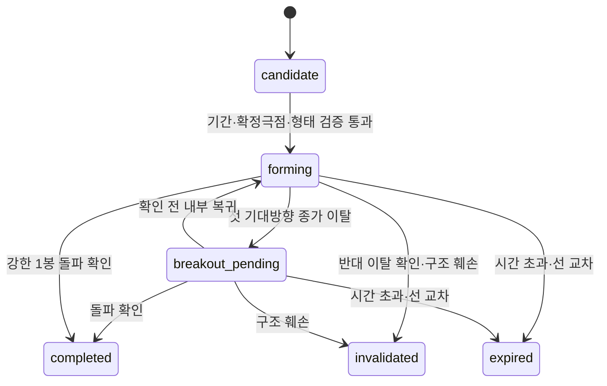

# 일봉 패턴 탐지 정확도 개선안

작성일: 2026-09-22 · 상태: 탐지 로직 적용 (하단 적용 기록 참고)

## 1. 목표와 권장 방향

**20~200개 일봉 안에서 의미 있는 고점·저점이 실제로 지지하는 구조만 검색하고, 기존 구조가 깨지면 선을 다시 맞춰 살리지 않고 종료한다.** 현재 ATR 기반 ZigZag와 두 점 앵커 방식은 유지하되, 기간 계산·직선 검증·상태 추적을 강화하는 방향을 권장한다.

이번 문서는 저장소 코드 정적 검토를 바탕으로 한다. 실제 종목별 오탐률과 개선 효과를 측정한 결과는 아니며, 아래 수치 중 새로 제안한 임계값은 검증 전 초기값이다. 20~200봉은 이번 제품 요구사항이며, 모든 시장에 통용되는 패턴 표준 기간을 의미하지 않는다.

핵심 변경은 다음과 같다.

1. 그려지는 선 길이가 아닌 **실제 구조의 시작과 끝**으로 기간을 계산한다.
2. 두 점을 이은 선에 세 번째 이후 극점과 구간 내 모든 일봉이 부합하는지 검증한다.
3. 새 일봉을 기존 선에 먼저 대조해 정상 돌파·반대 이탈·구조 훼손을 구분한다.
4. 형성 중 구조와 이미 발생한 돌파 이벤트를 별도로 관리한다.
5. 긴 패턴 우선 선택을 폐지하고, 기간을 통과한 후보 중 구조 품질로 대표를 고른다.

## 2. 현재 구현에서 확인한 원인 후보

| 코드 위치 | 확인한 현재 동작 | 문제 가능성 / 개선 방향 |
|---|---|---|
| `batch/config.py`, `batch/patterns/__init__.py` | 공통 `PATTERN_MIN_BARS=10`; `points` 첫 점~끝 점으로 최소 기간 필터, 공통 최대 기간 없음 | 짧은 구조가 돌파 대기·선 연장으로 최소 길이를 통과할 수 있음. 명시적 구조 구간으로 20~200봉 검사 |
| `batch/patterns/trend.py` | minor 20~120, major 40~250의 인덱스 차 허용 | major가 요구 상한을 초과. 봉 수는 양 끝 포함 `end-start+1`로 통일 |
| `double.py`, `multi.py`, `round.py` | major 쌍바닥 간격 250, H&S/트리플 최대 300, 라운드 최대 240 | 모듈별 상한과 공통 상한을 동시에 정리 |
| `batch/patterns/swing.py` | ATR 기반 minor/major 스윙, `confirmed_at` 보유 | 재활용할 기반이 이미 있음. 단순히 ZigZag를 새로 도입하는 것으로 해결되지 않음 |
| `fit_swing_trendline()` | 위반 없는 선을 우선하지만 모든 후보가 위반하면 위반 선도 반환 가능; 유효 여부는 반환하지 않음 | 유효 후보가 없으면 명시적 실패 반환. 호출부의 다른 필터에 의존하지 않기 |
| `trend.py` | 종가 안착률 80%와 채널 폭 10% 여유 사용 | 넓은 채널이나 연속 이탈이 평균에 가려질 수 있음. 최대 이탈·연속 이탈 별도 검사 |
| `trend.py` | 상승/하락삼각형의 선을 품질 검사 이후 완전 수평으로 변경 | 실제 표시·돌파 기준선과 앞서 검증한 선이 달라짐. 최종 선 확정 후 모든 검사 재실행 |
| `trend.py` 돌파 스캔 | 기대 방향 돌파와 선 교차는 검사하지만 단방향 패턴의 반대 경계 이탈은 무효화하지 않음 | 지지선이 깨진 상승삼각형이 형성 중으로 남거나 나중에 완성될 가능성 |
| `trend.py`, `dedupe_patterns()` | 겹치는 후보 중 긴 구조 우선 | 좋은 짧은 구조보다 늘어진 구조를 대표로 선택할 수 있음 |
| `PatternHit`, `run.py`, `writer.py` | `forming`, `completed_at` 중심; 명시적 붕괴 사유·생애주기 없음 | 매일 재탐지 결과만으로는 어제 구조가 오늘 왜 달라졌는지 설명하기 어려움 |

기존 문서 [PATTERN_PLAN.md](../PATTERN_PLAN.md)의 스윙 기반 설계를 보완한다. 현재 반대 이탈 누락에 관한 지적은 직접 확인한 추세선 계열에 해당하며, 다른 모든 탐지기에도 동일한 결함이 있다고 단정하지 않는다.

## 3. 20~200봉의 정확한 의미

### 3.1 구간을 분리한다

| 필드 | 의미 |
|---|---|
| `structure_start` | 패턴을 구성하는 첫 필수 극점/구간의 봉 |
| `structure_end` | 패턴을 구성하는 마지막 필수 극점/구간의 봉 |
| `structure_bars` | `structure_end - structure_start + 1`; 반드시 20~200 |
| `recognized_at` | 필요한 극점이 확정되고 구조 검증이 끝나 실제 인식 가능한 봉 |
| `evaluated_at` | 현재 상태를 평가한 봉 |
| `breakout_at` | 돌파 확인 조건을 충족한 봉 |
| `render_end` | 차트에 선을 연장하는 끝; 길이 필터에 사용하지 않음 |

기간 단위는 달력 일수가 아니라 정제된 거래일 일봉 행 수다. 휴장일을 채워 넣지 않는다. 거래정지·결측은 행을 무작정 압축해 양옆 가격을 연결하지 않고 별도 단절 표식을 남긴다. 장기 거래정지와 수정주가 불일치 구간을 가로지르는 후보는 제외한다.

**권장 엄격 정책:** 구조 길이 20~200뿐 아니라, 형성 중/돌파 대기 후보도 `평가봉 - structure_start + 1 <= 200`을 만족해야 한다. 따라서 190봉 구조는 남은 10봉까지만 대기하고, 200봉째 돌파 확인은 허용하되 201봉째는 만료한다. 200봉 구조가 마지막 극점 확정 지연 때문에 201봉 이후에야 인식되면 활성 검색에서는 제외한다. 과거 200봉 이내에 확인된 완성 이벤트는 이후에도 이력으로 보존한다.

이는 “최근 200봉만 잘라 모든 계산을 시작한다”는 뜻이 아니다. ATR과 ZigZag는 이전 상태에 영향을 받으므로 기존 이력 또는 저장된 상태에서 계산하고, 후보의 범위만 제한한다. 검색의 ‘최근 5/21/63봉 내 발생’은 별도 조건으로 유지한다.

### 3.2 패턴별 구조 범위

| 계열 | 구조 범위 및 권장 제약 |
|---|---|
| 삼각형·쐐기·브로드닝 | 최종 선을 지지하는 필수 극점의 처음~마지막, 20~200봉 |
| 쌍바닥·더블탑 | 첫 바닥/천장~두 번째 바닥/천장, 20~200봉; 넥라인 돌파 대기로 길이를 채우지 않음 |
| H&S·3중바닥/탑 | 첫 어깨/극점~마지막 어깨/극점, 20~200봉 |
| 컵앤핸들 | 좌측 림~핸들 구조 끝, 합계 최대 200봉; 컵 자체 최소 30봉 유지 |
| 라운드 | 좌측 림~우측 회복 구간, 기존 최소 60봉 유지·최대 200봉 |
| 플래그 | 조정 구간 자체 20~60봉을 초기 정책으로 제안; 깃대는 별도 맥락 필드, 깃대 시작~확인봉도 200봉 이내 |
| 다이아몬드 | 확대와 수렴을 모두 포함한 첫~마지막 필수 구조점, 20~200봉 |

20봉 미만의 플래그 등은 일반적인 차트 해석에서 존재할 수 있지만, 이번 검색 정책에서는 제외한다. 계열 고유의 더 엄격한 최소 길이까지 일괄 20봉으로 낮추지는 않는다.

## 4. 의미 있는 고점·저점 선정

기존 `max(k × ATR14, p% × 가격)` 반전 임계와 minor/major 두 스케일을 우선 유지한다. 임계까지 동시에 변경하면 기간·무효화 개선 효과를 분리해 평가하기 어렵다.

다음 검증을 추가한다.

- **확정 시점:** 극점 봉과 알 수 있게 된 봉을 분리한다. `confirmed_at <= 평가봉`인 극점만 활성 검색의 필수 근거로 사용한다. 잠정 극점은 보조 점선으로만 표시한다.
- **독립적인 접촉:** 같은 고점권에 밀집한 봉들을 여러 번의 터치로 세지 않는다. 초기에는 접촉 간 최소 3봉과 중간 반대 방향 스윙을 요구한다. 시간 간격 변경은 구조 확정 지연에 반영한다.
- **돌출도:** 극점 양옆의 반대 스윙 대비 반전 폭을 ATR로 기록한다. 미세한 흔들림은 접촉 수를 늘리는 근거로 쓰지 않는다.
- **중간 극점 보존:** 앵커를 선택하지 않은 극점도 위반 검사에서는 제외하지 않는다. major 후보도 원시 OHLC와 minor 극점의 큰 이탈을 검사한다.
- **예외 데이터:** 비정상 OHLC, 수정 전후 가격 혼재, 긴 결측은 분리·보류한다. 현재 수집기의 기업행위 의심 검사와 연결하며 중복 구현하지 않는다.

접촉 간격만으로 이미 확정된 과거 극점을 조용히 지우거나 교체하지 않는다. 필요하면 탐지 스케일별 새 구조 버전으로 취급한다.

## 5. 직선 적합성과 전체 구간 검증

### 5.1 선 후보 생성

고점 두 개로 상단선 `U(t)=a_u*t+b_u`, 저점 두 개로 하단선 `L(t)=a_l*t+b_l`을 만든다. 후보 생성은 스윙 조합으로 제한하고, 각 선은 선택되지 않은 극점과 모든 봉으로 검증한다. 20, 40, 60일 고정 창만 검사하면 경계에 걸린 실제 구조를 놓치므로, 의미 있는 극점을 시작·끝 후보로 사용한다.

두 점만 있으면 언제나 직선이 생긴다. 추세선 계열의 초기 품질 기준은 **양쪽 각 2회 이상, 합계 5회 이상 독립 접촉**, 즉 적어도 한쪽의 세 번째 검증점이다. 양쪽 3회 이상은 더 높은 품질로 평가한다. 2+2만 있는 구조는 내부 후보로 유지하며 기본 검색에는 내보내지 않는다. 쌍바닥처럼 구조 정의 자체가 다른 패턴에는 이 규칙을 그대로 적용하지 않는다.

### 5.2 가격 오차를 변동성 단위로 계산

일봉 `t`에서 `A(t)=max(ATR14(t-1), 유효 최소 호가단위)`를 기준으로 사용한다. 당일 급등락이 당일 ATR을 키워 자신의 이탈을 정당화하는 현상을 줄이기 위한 선택이다. 스윙 추출의 기존 ATR 방식과는 분리된 선 검증 기준이다.

초기 실험값:

| 검사 | 제안 기준 |
|---|---|
| 극점 접촉 | `abs(극점가격 - 해당 선) <= 0.5 × A(t)` |
| 구조 내부의 큰 꼬리 위반 | `high > U+1.0A` 또는 `low < L-1.0A`이면 엄격 후보 탈락 |
| 구조 내부 종가 안착 | `L-0.25A <= close <= U+0.25A` 비율 90% 이상 |
| 연속 이탈 | 경계 밖 0.5A 초과 종가 2봉 연속이면 평균 안착률과 관계없이 탈락 |
| 선의 유효 폭 | 모든 구조 봉에서 `U(t)>L(t)`; 인식 시점까지 교차가 없어야 함 |
| 지지 범위 | 각 선의 접촉들이 전체 구조 길이의 60% 이상을 지지하고, 마지막 접촉이 구조 후반 30% 안에 있음 |

폭이 넓으면 오차 허용도 같이 커지는 기존 방식 대신 ATR 기준을 우선한다. 저유동성 종목처럼 ATR이 아주 작은 경우는 호가단위와 데이터 품질 조건을 함께 적용한다.

**선이 유효하지 않으면 실패를 반환한다.** `fit_swing_trendline()`은 `LineFit | None`을 반환하도록 바꾸고, 접촉점·최대 위반량·연속 이탈 수를 함께 기록한다. 모든 후보가 위반하는데 그중 가장 나은 선을 정상 선으로 반환하지 않는다.

### 5.3 선 변경 후 재검증

수평선 강제, 구조 앞부분 트리밍, 극점 추가로 선이 바뀌면 기간·접촉 수·안착률·최대 위반·패턴 분류를 모두 다시 계산한다. 범위 밖 점을 접촉 수에 포함하지 않는다. 트리밍 후에도 사용하는 앵커는 구조 범위에 포함해야 하며, 앵커를 제외했다면 남은 점으로 다시 적합한다.

분류는 마지막에 수행한다. 수렴 삼각형·쐐기는 시작/끝 폭 비율, 두 선의 기울기와 교차 위치를 함께 확인한다. ‘수평’도 봉당 고정 퍼센트만 보지 않고 **구조 전체의 선 이동량/ATR 및 가격 대비 이동률**로 검증해, 긴 기간에 누적된 기울기가 수평으로 분류되지 않도록 한다.

고점 하나가 선 아래에 있다고 즉시 붕괴는 아니다. 채널 안쪽에 머문 낮은 고점은 비접촉점일 수 있다. 다만 두 번 연속 의미 있는 고점이 접촉 허용 범위를 벗어나거나 한쪽 선의 지지가 오래 끊기면 기존 모양을 유지한다고 보기 어렵다. 초기 ‘지지 소실’ 기준은 같은 종류의 확정 극점 2회 연속 비접촉 또는 `max(10, ceil(0.3 × 등록 시 구조봉수))`봉 동안 접촉 없음으로 제안한다.

## 6. 정상 돌파와 패턴 붕괴의 구분

“직선으로 연결되지 않는 고점”은 다음처럼 나누어 처리한다. 판정 대상은 **기존 등록 선**이며, 새 가격에 맞춰 먼저 선을 움직이지 않는다.

| 상황 | 처리 |
|---|---|
| 고점이 상단선 0.5ATR 이내 | 정상 접촉 |
| 고점은 조금 넘었지만 종가는 내부, 큰 꼬리 기준 미만 | 일시적 꼬리 이탈로 기록하고 유지 |
| 상승삼각형이 상단선을 종가로 유효 돌파 | 정상 완성 가능 |
| 상승삼각형이 하단선을 종가로 유효 이탈 | 기존 상승삼각형 무효화 |
| 삼각수렴이 위/아래 중 한쪽을 유효 돌파 | 해당 방향 완성; 수렴형은 양방향 허용 |
| 하락쐐기가 위로 돌파 / 아래로 이탈 | 각각 기대 방향 완성 / 기존 구조 무효화 |
| 큰 꼬리 이탈 후 내부 복귀 또는 두 경계를 같은 봉에서 크게 침범 | 엄격 정책에서는 구조 훼손으로 종료; 일봉만으로 장중 순서 추정 금지 |
| 새 고점·저점이 안쪽에 있지만 기존 선을 계속 지지하지 않음 | 지지 소실 기준 충족 시 종료, 새 구조는 별도 후보로 탐색 |
| 선 교차, 대기 기한 초과, 200봉 초과 | 만료 |

초기 돌파/반대 이탈 확인 기준은 **경계를 0.5ATR 넘긴 종가 2봉 연속**, 또는 **1.5ATR 넘긴 종가 1봉**이다. 2봉 확인의 이벤트 날짜는 두 번째 봉이며 첫 번째 봉으로 소급하지 않는다. 거래량은 보조 정보로 기록하고, 형태 성립의 필수 조건은 별도 검증 전 추가하지 않는다.

기대 방향의 첫 종가 이탈은 `breakout_pending`으로 두고, 다음 봉 내부 복귀 시 형성 중으로 되돌린다. 큰 꼬리 위반보다 유효한 방향 돌파 확인을 우선하되, 같은 봉이 양쪽 경계를 크게 침범한 경우는 구조 훼손을 우선한다. 반대 방향도 첫 이탈부터 활성 검색에서 잠시 제외하고 확인되면 무효화한다.

수치 예: 상단 10,000원, 하단 9,400원, ATR 200원인 상승삼각형에서 고가 10,080원·종가 9,950원은 허용 가능한 꼬리다. 종가가 상단+100원을 초과해 2봉 유지되면 완성한다. 반대로 하단-100원을 초과해 아래로 2봉 유지되면 무효화한다. 매 봉 기울어진 선의 해당 날짜 가격을 다시 계산한다.

## 7. 매일 갱신해도 흔들리지 않는 상태 관리

반대 방향 확인 대기는 `pending_direction`으로 기록하고 검색 노출을 중지한다. `invalidated`와 `expired`는 종료 상태다. 같은 ID를 다음 날 다시 형성 중으로 부활시키지 않는다.

`completed`는 과거에 실제 확인된 이벤트다. 이후 돌파가 실패해도 이벤트를 삭제하지 않고 `post_breakout_status=failed`와 실패 확인일을 추가한다. 초기 실패 기준은 완성 후 5봉 내 돌파선 안쪽으로 0.5ATR 이상 2봉 연속 복귀이며, 별도 검증 대상이다. ‘최근 돌파 발생’ 검색과 ‘돌파 후 현재 유지’ 검색은 구분한다.

### 선을 고정하는 원칙

- 후보 탐색 중에는 선을 다시 적합할 수 있다.
- 검색에 등록한 구조는 앵커와 선을 고정하고 새 일봉을 먼저 검증한다.
- 유효성을 유지하면서 확장된 후보가 생기면 새 버전으로 기록한다. 새 선의 인식일 이전에 돌파를 소급 생성하지 않는다.
- 구 구조가 이미 깨졌으면 새 선으로 과거 이탈을 지우지 않는다. 새 ID 또는 명시적인 후속 구조로 기록한다.
- 종목·시간축·계열·앵커 날짜·탐지 버전으로 안정적인 ID를 만든다. 매일 달라질 수 있는 데이터 배열 인덱스를 ID로 사용하지 않는다.

최초 구현은 기존 전체 배치 안에서 날짜 순으로 상태를 재생하는 방식이 검증하기 쉽다. 이후 영속 상태와 당일 봉만 갱신하는 증분 방식으로 최적화한다. 수정주가·누락 보정·알고리즘 변경 때는 해당 이력을 새 데이터 버전으로 재생하고 기존 결과와 차이를 기록한다.

## 8. 품질 점수와 중복 제거

기간·중대한 위반·미확정 극점은 점수로 상쇄할 수 없는 필수 탈락 조건이다. 통과한 후보끼리만 다음 항목으로 비교한다.

| 항목 | 초기 배점 |
|---|---:|
| 양쪽의 독립적인 접촉 수와 균형 | 30 |
| ATR로 정규화한 선 잔차 | 25 |
| 구간 안착률과 작은 이탈의 빈도 | 20 |
| 접촉점의 시간 분포·최근 지지 | 15 |
| 계열 고유 형태: 수렴, 대칭, 깊이 등 | 10 |

이 점수는 동일 계열 내 후보 순위용이다. 정확도 확률이나 수익률로 표시하지 않는다. 현행 `shape.py` 점수와 임계값은 계산 방식이 달라 그대로 재사용하지 않고 라벨 표본으로 재보정한다.

중복 그룹은 계열·방향·상태·구조 구간 겹침·공유 앵커로 결정한다. 기존 50~60% 겹침만으로 판단하면 독립적인 작은 구조가 큰 구조에 흡수될 수 있다. 대표는 **구조 품질 → 독립 접촉 수 → 작은 잔차 → 결정적 ID 순서**로 선택하고, 길이 자체에는 가산점을 주지 않는다. 완성 이벤트와 형성 중 구조는 별도로 보존한다.

## 9. 데이터와 검색·차트 연동

`PatternHit`와 쌍바닥 등 별도 결과 타입을 공통 결과 모델로 정리한다.

| 추가 필드 | 용도 |
|---|---|
| `id`, `parent_id`, `version`, `algorithm_version`, `data_version` | 같은 구조 식별, 갱신·보정 추적 |
| `structure_start/end`, `structure_bars`, `recognized_at`, `evaluated_at` | 기간과 실제 인식 시점 분리 |
| `status`, `pending_direction`, `breakout_at`, `invalidated_at`, `expired_at` | 상태 전이 기록 |
| `reason_code` | `opposite_break`, `extreme_violation`, `lost_support`, `max_age`, `apex_cross` 등 |
| `anchors`, `upper_line`, `lower_line`, `touch_points` | 판정과 차트가 같은 선을 사용 |
| `max_violation_atr`, `containment`, `quality_components` | 탈락·대표 선정 이유 설명 |
| `post_breakout_status`, `failed_at` | 과거 돌파와 이후 실패 분리 |

`run.py`는 동일한 결과 집합에서 활성 형성 중 검색과 완성 이벤트 검색을 생성하고, `writer.py`는 같은 객체를 직렬화한다. 무효화·만료는 기본 검색에서 제외하되 상세 차트 이력에서는 종료일과 이유를 볼 수 있게 한다.

차트는 실제 접촉점을 표시하고 원래 앵커선과 연장선을 구분한다. 사용자는 ‘72봉 · 상단 3회/하단 2회 접촉 · 하단 이탈로 종료’처럼 결과를 이해할 수 있어야 한다. 데이터 기준일도 표시한다.

현재 상세 차트 250봉과 미니 차트 120봉은 200봉 구조 또는 오래된 이벤트의 전체 범위를 담지 못할 수 있다. 검색에서 선택한 패턴 ID와 필요한 구간을 함께 전달하고, 범위가 부족하면 확대 데이터/상세 차트로 연결한다. 전체 차트를 못 그린다는 이유로 정상 검색 이벤트를 조용히 없애지 않는다. 초기 개선에서는 필요한 구간을 포함하는 정적 상세 데이터 범위 확장도 함께 검토한다.

## 10. 구현 순서

| 단계 | 변경 대상 | 완료 조건 |
|---|---|---|
| 1. 공통 기간·치명적 오탐 교정 | `config.py`, 결과 모델, 각 탐지기, `__init__.py`, `trend.py` | 모든 결과에 구조 범위; 20~200봉 적용; 반대 이탈 무효화; 최종 선 재검증 |
| 2. 추세선 품질 | `swing.py`, `trend.py`, `shape.py` | 유효선 없음 반환, 독립 접촉, 모든 봉 위반 검사, 길이 우선 병합 제거 |
| 3. 상태와 인과성 | 상태 재생 모듈 신설, 탐지기 어댑터, `run.py` | 선/이벤트 이력 고정, 종료 구조 부활 방지, 미래 데이터 비참조 |
| 4. 산출물과 UI | `writer.py`, 웹 및 Flutter 패턴 모델/차트 | 검색·차트 ID 일치, 상태·종료 사유·기간 표시, 구버전 호환 전환 |
| 5. 검증·적용 | `batch/tests`, `scripts/render_patterns.py` 확장 | 고정 평가셋 비교, 새 배치 병행 산출, 검증 후 서비스 전환 |

단계 1~2를 우선 진행하되 일일 재계산으로 선이 바뀌는 문제는 단계 3까지 마쳐야 해결됐다고 볼 수 있다. 컵·라운드처럼 곡선이 본질인 계열은 직선에 억지로 맞추지 않고 공통 기간·상태 정책만 공유한다. 다이아몬드는 확대/수렴 구간을 나눠 검증한다.

## 11. 검증 방법과 합격 기준

### 11.1 반드시 통과해야 할 동작 검증

| 시나리오 | 기대 결과 |
|---|---|
| 구조 19/20/200/201봉 | 각각 탈락/허용/허용/탈락. 그 밖의 조건은 동일하게 구성 |
| 구조 12봉 + 돌파 대기 15봉 | 기간 미달; 선 길이를 합쳐 통과시키지 않음 |
| 200봉째 돌파 확인 / 201봉째 확인 | 허용 / 만료 |
| 앵커 2개뿐, 또는 접촉이 한 구간에 몰림 | 강한 패턴으로 노출하지 않음 |
| 좋은 60봉 후보와 위반이 많은 180봉 후보 중복 | 긴 후보를 자동 우선하지 않음 |
| 종가 안착률은 높지만 중간에 큰 이탈 존재 | 구조 탈락 또는 해당 날짜 무효화 |
| 상승삼각형 하단 이탈 뒤 뒤늦게 상단 돌파 | 옛 구조의 완성으로 기록하지 않음 |
| 선을 수평으로 바꾸자 접촉 수가 부족해짐 | 최종 재검증에서 탈락 |
| 잠정 고점이 다음 날 높아짐 | 과거 확정 이벤트는 불변, 잠정 표시만 변경 |
| 새 종가를 맞추려고 선을 바꿔야 함 | 기존 구조는 먼저 평가·종료; 새 버전의 미래 판정만 허용 |
| 수정주가·중간 결측·거래정지·아웃사이드 바 | 가짜 연결 차단, 재계산 사유 기록 |

### 11.2 실제 차트 표본 검증

1. 초기 300개 이상 구간을 계열·20~40/41~100/101~200봉·대형/중소형·변동성별로 나눈다. 기존 탐지 성공 사례뿐 아니라 오탐과 **미탐을 평가할 무작위 구간**도 포함한다.
2. 검토자가 정답 패턴, 시작·끝, 주요 극점, 종료 사유를 라벨링한다. 애매한 사례는 별도 보류하며 억지로 정답 처리하지 않는다.
3. 종목과 시간을 분리해 튜닝셋/고정 평가셋을 만든다. 겹치는 구간이 양쪽에 들어가지 않게 한다.
4. 같은 입력으로 현행/개선 결과와 고점·저점·허용 오차대를 나란히 렌더링한다. 모양 평가를 수익률 평가와 분리한다.

측정 항목은 탐지 정밀도, 라벨 구간 재현율, 시작/끝 봉 오차, 기간 위반 수, 무효 구조 잔존율, 과거 이벤트 변경률, 검색·차트 불일치, 배치 시간이다. 기간 위반·미래 참조·종료 구조 부활·설명 없는 과거 이벤트 변경은 0건이 필수다. 정확도 목표는 초기 제안으로 고정 평가셋의 정밀도 10%p 개선, 재현율 하락 5%p 이내로 두되 계열별 표본 수와 불확실성을 함께 보고 조정한다. 아직 달성한 수치가 아니다.

### 11.3 날짜 순 재생 검증

과거 데이터 전체에서 패턴을 구한 다음 과거 날짜에 붙여 넣지 않는다. 매 날짜 `t`까지의 데이터만으로 실행한 결과와 순차 상태 재생 결과를 비교한다. `recognized_at`, 돌파일, 사용 앵커, 당시 선이 일치해야 한다. `confirmed_at` 필드가 있다는 사실만으로 모든 계열의 미래 참조가 방지됐다고 가정하지 않는다. 특히 컵·라운드·다이아몬드의 별도 확정 방식도 검사한다.

성능은 종목당 스윙/선 후보 수를 기록하고 200봉 밖 후보를 조기 제외해 관리한다. 캐시를 도입할 때는 입력 해시·데이터 버전·알고리즘 버전을 키에 포함한다. 정확한 전체 재생과 증분 갱신이 같은 결과를 내는 것이 최적화의 전제다.

## 12. 참고 근거와 이번 설계의 선택

- [StockCharts: Trend Lines](https://chartschool.stockcharts.com/table-of-contents/chart-analysis/trend-lines): 두 점으로 선을 만들고 추가 접촉으로 검증하며, 점들의 간격과 억지 연결을 주의해야 한다는 설명을 참고했다. 이번 설계의 2+3 접촉과 구간 검증은 이를 제품 기준으로 구체화한 제안이다.
- [TradingView: Zig Zag](https://www.tradingview.com/support/solutions/43000591664-zigzag-indicator/): 새 가격에 따라 최근 ZigZag 구간이 바뀔 수 있다는 동작을 참고해 잠정 극점과 확정 시점을 분리했다.
- 기간 20~200, ATR 오차 배수, 2봉 확인, 점수 배점, 만료·지지 소실 조건은 위 자료가 보증하는 보편값이 아니다. 실제 서비스의 라벨 차트와 날짜 순 재생으로 검증할 **프로젝트 제안값**이다.

우선 적용 권장 범위는 **명시적 구조 기간 + 추세선 반대 이탈 무효화 + 최종 선 재검증 + 긴 구조 우선 제거**다. 이후 고정된 선의 상태 추적까지 연결해야, 매일 새 가격에 맞춰 무너진 패턴이 다시 그려지는 문제를 줄일 수 있다.

## 13. 2026-09-22 적용 기록

변경 전 원격 `main` 체크포인트: `af5f4bdc` (기존 변경 사항과 이 설계 문서 포함).

이번 변경에서 실제 적용한 내용:

- 전체 탐지 결과의 구조 길이 20~200봉, 형성/돌파 대기까지 시작 후 최대 200봉. 구조 범위를 별도 보유하고, 기존 결과 타입은 실제 구성점 범위를 공통 함수로 해석한다.
- 계열별 긴 기간 상한 조정, 플래그 실제 조정 최소 20봉, 컵 전체 구간 상한 및 실제 림 확정 시점 적용.
- 추세선 최종 형태에서 독립 접촉 각 2회·합계 5회 이상 검증. 기존 엄격 계열은 양쪽 극점 각 3개 조건을 유지한다. 초기 ZigZag 시작점은 이전 반전 근거가 없으므로 추세선 앵커에서 제외한다.
- 직선 적합 실패를 명시적으로 반환. ATR 기준 원시 고가·저가 이탈, 종가 안착률 90%, 연속 이탈 검사. 전일 ATR을 공유 계산한다.
- 수평선 변경 후 재검증. 접촉 분포는 기존 사례의 재현성을 고려해 각 선의 접촉 범위 50%, 앞뒤 40% 지지 조건으로 적용했다 (설계안 60%/30%보다 완화).
- 추세선 등록 순서대로 고정 선을 재생한다. 반대 이탈·큰 꼬리 훼손·새 확정 극점의 같은 쪽 2회 연속 비접촉·교차·시간 초과로 종료한다. 최초 종가 이탈은 확인 대기로 검색에서 제외한다.
- 추세선은 0.5ATR 초과 종가 2봉 또는 1.5ATR 초과 1봉으로 돌파 확인한다. 다른 계열의 고유 넥라인 돌파 규칙은 유지한다.
- 종료 구조를 내부 기록으로 유지해 공유 앵커와 생애 구간이 겹치는 같은 계열의 재적합 후보를 억제한다. 같은 날 후보는 접촉 수·안착률·ATR 잔차로 선택한다. 이후 긴 후보가 이미 확정된 이벤트를 밀어내지 않게 한다.
- 기존 형태 점수는 등록 시점에 고정하고 선 연장으로 재채점하지 않는다. 전체 계열의 점수 체계를 새 배점으로 바꾸는 작업은 수행하지 않았다.
- 다이아몬드의 신고가 무효화 누락과 컵·라운드·다이아몬드의 확정 시점 사용을 보완했다.
- 차트 JSON에 구조 시작/끝·봉 수·인식일을 추가했다. 상세 데이터는 최대 200봉 구조와 최근 63봉 이벤트를 담도록 263봉으로 조정했다.

호환성을 위해 기존 검색 키와 `forming`/`completed_date`·차트 선 포맷은 유지한다. 상태는 매 배치에서 인과적으로 재생하며, 별도 DB 상태 저장·무효화 이력 UI·돌파 후 실패 검색·신규 점수의 라벨 표본 보정은 이번 코드 변경에 포함하지 않는다. 이는 위 설계안의 확장 항목이다.

검증은 기존 단위 테스트와 기간 경계·반대 이탈·돌파 확인일·종료 후 재적합·과거 선/이벤트 안정성 회귀 테스트에 한정한다. 저장된 삼성전자·SK하이닉스·NAVER 각 800봉으로 탐지와 차트 JSON 직렬화도 확인했다. 전 종목 장기 재백테스트 및 외부 시세 재수집은 하지 않았다.
